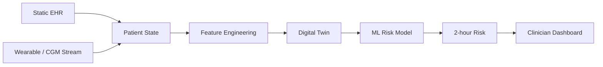

# GlucoTwin Architecture

## Data -> Twin -> Prediction -> Action

The prototype combines two streams into a continuously refreshed patient state.

1. **Static EHR layer:** demographics, BMI, HbA1c, disease duration, BP, family history, medication adherence and baseline glucose.
2. **Dynamic layer:** CGM-style glucose, heart rate, HRV, activity and sleep observations.
3. **Feature engine:** slopes, rolling means/variability and recent activity.
4. **Digital Twin state:** the fused representation of the virtual patient at a given time.
5. **Prediction:** Logistic Regression baseline and Random Forest candidate estimate 2-hour glucose-spike risk.
6. **Human-facing output:** probability, risk tier, physiological trajectory and clinician interpretation.

## Safety boundary

The PoC deliberately stops at risk stratification. It does not diagnose disease, prescribe medicine or change treatment.

## Mermaid architecture

